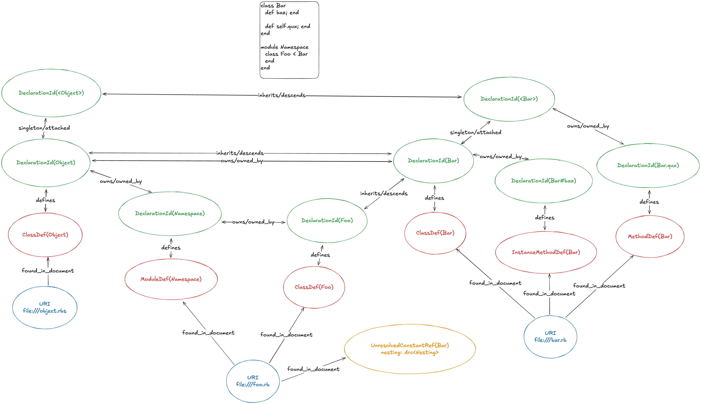

# Architecture

Rubydex indexes Ruby codebases in two distinct stages: **Discovery** and **Resolution**. Understanding this separation is crucial for working with the codebase.

## Core Concepts: Definition vs Declaration

A **Definition** represents a single source-level construct found at a specific location in the code. It captures exactly what the parser sees without making assumptions about runtime behavior.

A **Declaration** represents the global semantic concept of a name, combining all definitions that contribute to the same fully qualified name. Declarations are produced during resolution.

Consider this example:

```ruby
# foo.rb
module Foo
  class Bar; end
end

# other_foos.rb
class Foo::Bar; end
class Foo::Bar; end
```

**Definitions** (4 total - what the indexer discovers):

1. Module definition for `Foo` in `foo.rb`
2. Class definition for `Bar` (nested inside `Foo`) in `foo.rb`
3. Class definition for `Foo::Bar` in `other_foos.rb`
4. Class definition for `Foo::Bar` in `other_foos.rb`

**Declarations** (2 total - what resolution produces):

1. `Foo` - A module that has a constant `Bar` under its namespace
2. `Foo::Bar` - A class, composed of definitions 2, 3, and 4

## Two-Stage Indexing Pipeline

### Stage 1: Discovery

Discovery walks the AST and extracts definitions from source code. It captures **only what is explicitly written**, making no assumptions about runtime behavior.

**What Discovery does:**

- Creates `Definition` objects for classes, modules, methods, constants, variables
- Records source locations, comments, and lexical ownership (`owner_id`)
- Captures unresolved constant references (e.g., `Foo::Bar` as a `NameId`)
- Records mixins (`include`, `prepend`, `extend`) on their containing class/module

**What Discovery does NOT do:**

- Compute fully qualified names
- Resolve constant references to declarations
- Determine inheritance hierarchies
- Assign semantic membership

#### Why No Assumptions During Discovery?

Consider this example:

```ruby
module Bar; end

class Foo
  class Bar::Baz; end
end
```

Without resolving constant references, it may appear that `Bar::Baz` is created under `Foo`. But it's actually not - `Bar` resolves to the top-level `Bar`, so the class is `Bar::Baz`, not `Foo::Bar::Baz`.

Discovery cannot know this without first resolving `Bar`. This is why fully qualified names and semantic membership are computed during Resolution, not Discovery.

### Stage 2: Resolution

Resolution combines the discovered definitions to build a semantic understanding of the codebase.

**What Resolution does:**

- Compute fully qualified names for all definitions
- Create `Declaration` objects that group definitions by fully qualified name
- Resolve constant references to their target declarations
- Linearize ancestor chains (including resolving mixins)
- Assign semantic membership (which methods/constants belong to which class)
- Create implicit singleton classes from `def self.method` patterns

## Graph Structure

Rubydex represents the codebase as a graph, where entities are nodes and relationships are edges. The visualization below shows the conceptual structure (implemented as an adjacency list using IDs).

[Open in Excalidraw](https://excalidraw.com/#json=hQiLSD8nJRVxONhuwtSn4,L78TkfeB4YL1HJTf5L0bvw)



### Key Files

- `model/document.rs`: Represents a registered file (e.g., `foo.rb`, `other_foos.rb`)
- `model/definitions.rs`: Individual definitions discovered from source code
- `model/declaration.rs`: Global declarations produced during resolution
- `model/graph.rs`: The main graph structure containing all entities

### ID Types

Connections between nodes use hashed IDs defined in `ids.rs`:

- `DefinitionId`: Hash of URI, byte offset, and name
- `DeclarationId`: Hash of fully qualified name (e.g., `Foo::Bar` or `Foo#my_method`)
- `NameId`: Hash of unqualified name (e.g., `Bar` instead of `Foo::Bar`)
- `UriId`: Hash of file URI
